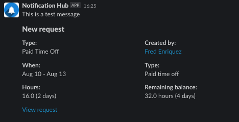

# slack-message-poc
Sending a message to a channel or user with Slack API.

***Note: This is a POC/Spike only and is not production ready***

## Requirements

See the app manifest.yaml for the app as code.

You also need to export the Slack app Oauth token as an environment variable `export SLACK_API_TOKEN=xxxx-xxxx-xxxx-xxxx`

## Payload

Include a target (**either** a single email or channel name) as a string.

Include **either** a Message or Blocks (Message takes presedence)

  

  

See slackmessage_test.go as an implementation example.
